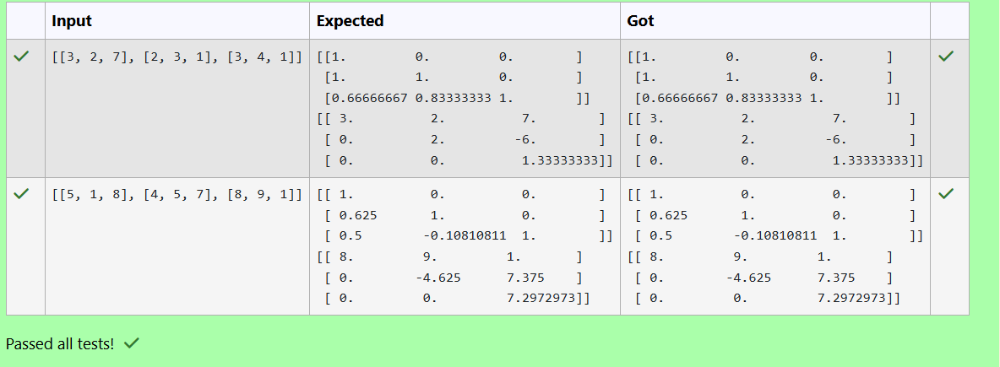

# LU Decomposition 

## AIM:
To write a program to find the LU Decomposition of a matrix.

## Equipments Required:
1. Hardware – PCs
2. Anaconda – Python 3.7 Installation / Moodle-Code Runner

## Algorithm
1. 
2. 
3. 
4. 

## Program:
(i) To find the L and U matrix
```
/*
Program to find the L and U matrix.
Developed by: SUMITH M
RegisterNumber: 24900643
*/import numpy as np
from scipy.linalg import lu
a=np.array(eval(input()))
p,l,u=lu(a)
print(l)
print(u)
```
(ii) To find the LU Decomposition of a matrix
```
/*
Program to find the LU Decomposition of a matrix.
Developed by: SUMITH M
RegisterNumber: 24900643
*/import numpy as np
from scipy.linalg import lu_factor,lu_solve
A=np.array(eval(input()))
B=np.array(eval(input()))
lu,piv=lu_factor(A)
X=lu_solve((lu,piv),B)
print(X)
```

## Output:



## Result:
Thus the program to find the LU Decomposition of a matrix is written and verified using python programming.

